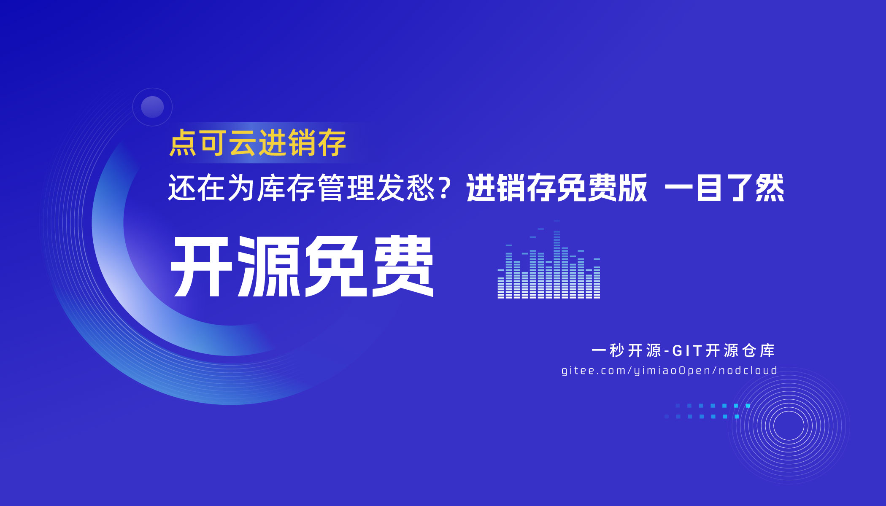

# 点可云ERP-开源进销存系统

**点可云ERP - 开源进销存系统**

## 重要通知：

- **源码来源**：本源码源自官方商业版本更新迭代后的纯净版，现面向公众提供免费下载与学习机会。
- **版权声明**：警惕不实信息！v6版本无需任何授权费用，直接下载、安装、搭建，版权清晰，无隐藏费用。
- **商用授权**：对于计划将本系统用于商业用途的用户，请参阅我们详细的商用授权指南。

❤️ ❤️ ❤️ **点赞与关注**
如果您认可本项目的价值，请点击 Star 支持，并关注我们的动态，您的每一份支持都是我们前进的动力！🙏

## 系统演示

## - **V5开源版**
  - 仓库地址：[https://gitee.com/yimiaoOpen/nodcloud-v5](https://gitee.com/yimiaoOpen/nodcloud-v5)
  - 演示地址：访问这里获取详细演示地址以及部分截图预览：https://2024.okmg.cn/277.html
  - 登录信息：账号 - admin, 密码 - admin888

## - **V6开源版（当前主推）**
  - 演示地址：访问这里获取详细演示地址以及部分截图预览：https://2024.okmg.cn/277.html
  - 登录信息：账号 - admin, 密码 - admin888

## - **V7开源版**
  - 仓库地址：[https://gitee.com/yimiaoOpen/erp-community](https://gitee.com/yimiaoOpen/erp-community)
  - 演示地址：访问这里获取详细演示地址以及部分截图预览：https://2024.okmg.cn/277.html
  - 登录信息：账号 - admin, 密码 - admin888

## **㊗️ V8全新商业版（限时优惠）**

## - **特色亮点**：
  - **技术革新**：基于Laravel 10与Vue 3的强大框架，确保系统运行流畅，响应迅速。
  - **多端覆盖**：
    - **App支持**：专为移动设备优化，无论您身在何处，都能通过手机App轻松管理进销存，实现业务随时随地掌控。
    - **小程序集成**：无缝对接微信小程序，让您的客户也能通过小程序下单、查询库存，提升用户体验，拓宽销售渠道。
  - **功能全面**：集进货、销售、库存、财务、报表等管理功能于一体，满足企业全方位的管理需求。
  - **安全稳定**：采用先进的加密技术，保障数据安全，确保您的业务信息无忧。

- **购买与咨询**：即刻联系我们，享受限时折扣优惠，让V8全新商业版成为您企业管理的得力助手！
- **演示入口**：[https://erp.nodcloud.com/](https://erp.nodcloud.com/)

## **微信群加入与联系方式**

欢迎您加入点可云进销存系统的大家庭！请扫描上方二维码快速加入我们的官方微信群，以便及时获取最新资讯、技术支持及用户交流。若二维码因故失效，请直接添加我们的客服微信（ID: diycloud），我们的客服团队将全天候为您提供帮助。

## **安装方式详解**

**:tw-1f18e: 安装方式一：手动安装（适合有一定服务器操作经验的用户）**
1. **准备阶段**：确保您的服务器已安装必要的Web环境（如Apache/Nginx、PHP、MySQL）。
2. **上传项目**：使用FTP或SCP工具将点可云进销存系统的项目文件上传至服务器指定目录。
3. **数据库准备**：通过MySQL管理工具（如phpMyAdmin、Navicat等）创建一个新的数据库，并记录下数据库名称、用户名及密码。
4. **开始安装**：在浏览器中访问[http://您的域名.com/install](http://您的域名.com/install)，按照页面提示填写数据库信息，完成安装流程。
5. **完成安装**：安装成功后，系统会自动跳转到系统登录页面，您可以使用预设的账号或新注册的账号登录系统。

**:tw-1f18e: 安装方式二：宝塔面板一键部署（适合初学者及快速部署需求）**
1. **登录宝塔面板**：使用您的宝塔面板账号登录到管理界面。
2. **选择软件商店**：在左侧导航栏中点击“软件商店”，进入软件商店页面。
3. **搜索并部署**：在搜索栏中输入“点可云”或相关关键词，找到点可云进销存系统后点击“一键部署”。
4. **配置域名**：在部署过程中，根据提示输入您的域名，并确认其他配置选项。
5. **等待部署完成**：部署过程可能需要一些时间，请耐心等待直至部署成功。

## **注意事项**
- 如在安装过程中遇到任何问题，请首先检查您的服务器配置是否符合要求。
- 若遇到404错误，请检查您的Web服务器配置及伪静态规则是否设置正确。
- 为确保系统安全，请在安装完成后及时更改默认管理员密码，并定期检查系统更新。

## **视频安装教程**

我们精心准备了多个视频教程，帮助您轻松完成安装和配置过程：
- **PHPstudy安装篇**：[观看视频](http://www.bilibili.com/video/BV1VT411Q7kV)
- **宝塔安装篇**：[观看视频](http://www.bilibili.com/video/BV1As4y1Y7Ps)
- **关闭数据库严格模式**：[观看视频](http://www.bilibili.com/video/BV1F54y1A7Vc)

## **系统介绍**

点可云进销存系统是一款功能强大、操作简便的企业级管理软件。它基于ThinkPHP框架和LayUI前端技术构建，集成了采购、销售、零售、多仓库管理、财务管理等核心功能模块，旨在为企业提供全方位的进销存解决方案。通过详尽的报表分析和灵活的设置选项，帮助企业实现精细化管理和高效运营。

## **软件架构**
- **后端**：采用ThinkPHP框架，确保系统稳定可靠、易于扩展。
- **前端**：运用LayUI前端框架，打造美观、易用的用户界面。

## **功能概览**
- **采购管理**：支持采购订单、采购入库单等操作，实现采购流程的全程跟踪和管理。
- **销售管理**：包括销货单、销货退货单等功能，助力企业提升销售效率和客户满意度。
- **零售管理**：支持零售单、零售退货单、服务单、积分兑换单等多种零售场景，满足企业多样化需求。
- **仓库管理**：提供库存查询、库存盘点、库存预警等功能，确保企业库存数据的准确性和及时性。
- **财务管理**：涵盖收款单、付款单、其他收入单、其他支出单等财务操作，助力企业实现财务的精细化管理。
- **报表分析**：提供详尽的数据报表和单据核销单功能，为企业决策提供有力支持。
- **系统设置**：包括基础资料、辅助资料、高级设置等选项，帮助企业轻松完成系统配置和个性化定制。

## **开源版使用详细须知**

**一、版权信息与使用规范**

1. **商业自用权限**：本项目（V6）版本允许用户在其业务范围内，以保留原始版权声明及许可证条款的方式，进行非盈利性的商业自用。这意味着您可以在公司内部部署、测试及优化此版本，但不得将其用于向第三方提供收费服务或销售。

2. **二次开发与销售**：任何基于本项目（V6）版本进行的二次开发或改进，若计划进行商业销售或向外部客户提供服务，必须先获得点可云公司的官方授权。未经授权，不得擅自进行盈利性传播或销售。

3. **严格禁止行为**：我们坚决禁止任何人或组织，以任何形式（包括但不限于网络下载、光盘销售、技术培训等）对本项目（V6）的代码、资源或衍生品进行收费传播。同时，也不得利用本项目（V6）进行任何直接或间接的盈利性活动，包括但不限于广告宣传、捆绑销售等。对于违反此规定的行为，我们将采取法律手段进行维权。

**二、点可云公司承诺与态度**

1. **推动开源事业**：点可云公司深知开源软件对于技术创新和行业发展的重要性，因此我们积极参与并推动开源事业的发展。我们致力于构建一个开放、合作、共赢的开源生态环境，让更多的人能够从中受益。

2. **维护生态健康**：我们坚决打击任何破坏点可云开源生态的行为，包括但不限于侵犯版权、恶意传播病毒、发布虚假信息等。我们将采取一切必要措施，保护开源社区的纯净性和健康发展。

## **三、技术支持与商业版推荐**

1. **技术支持与售后服务**：鉴于V6版本为开源免费版，我们提供有限的社区支持。若您在使用过程中遇到技术问题，可以尝试在官方论坛、Git仓库等社区平台寻求帮助。或在[https://2024.okmg.cn/ask/nod ](https://2024.okmg.cn/ask/nod)提问，若您需要更专业的技术支持或售后服务，建议考虑升级为V8商业版，并享受我们提供的全方位服务。

2. **商业版优势**：商业版（V8）不仅包含开源版的所有功能，还提供了更多的高级特性、定制化服务以及稳定的安全更新。我们为商业版用户提供全天候的技术支持、快速的售后服务响应以及定期的软件更新服务。这些服务将帮助您的业务更加高效、稳定地运行，并不断提升竞争力。

**四、结语**

感谢您选择点可云项目作为您的业务支撑工具。我们期待与您携手共进，共同推动开源事业的发展，共创美好未来。如果您在使用过程中有任何疑问或建议，请随时与我们联系。

#### :clap:  系统截图

 :heart:  鸣谢：

点可云公司，一秒互联公司

## V7商业版功能介绍

## V8全新商业版功能介绍

----------------------------------------------------------------------------------------
## 重要！BUG征集公告

### **GIT仓库开源项目BUG征集公告**

---

**致所有开源爱好者及开发者**：

为了持续提升[点可云ERP-V6.0]的质量和用户体验，我们特此发起GIT仓库开源项目的BUG征集活动。我们诚邀每一位使用[点可云ERP-V6.0]的用户和开发者积极参与，共同发现并报告项目中存在的问题，助力我们打造一个更加完善、稳定的开源产品。

**一、征集内容**

1. **BUG报告**：包括但不限于软件崩溃、功能异常、性能问题、安全漏洞等任何影响项目正常运行或用户体验的问题。
2. **复现步骤**：请尽可能详细地描述BUG的复现步骤，以便我们快速定位问题。
3. **环境信息**：提供发生BUG时的操作系统、浏览器（如果适用）、[点可云ERP-V6.0]版本等环境信息。
4. **截图或日志**：如果可能，附上问题发生时的截图、错误日志或堆栈跟踪信息，这将有助于我们更快地诊断问题。

**二、提交方式**

1. 访问我们的GIT仓库：[https://gitee.com/yimiaoOpen/nodcloud]。
2. 在仓库的“Issues”页面，点击“New issue”按钮创建一个新的Issue。
3. 选择适合的模板（如果提供），或直接填写问题描述、复现步骤、环境信息等必要内容。
4. 提交Issue前，请确保您已经检查了现有的Issue列表，避免重复提交。

**三、我们的承诺**

1. **及时响应**：我们将尽快对提交的BUG报告进行审查，并在合理的时间内给予反馈。
2. **公开透明**：所有提交的BUG报告及处理进度都将在仓库的Issues页面中公开，确保信息的透明度。
3. **表彰贡献**：对于积极参与BUG征集并提交高质量报告的用户和开发者，我们将在社区中公开表彰，并可能根据贡献情况给予一定的奖励或特权。

**四、额外说明**

1. 提交BUG时，请保持礼貌和尊重，避免使用攻击性或侮辱性的语言。
2. 如果您愿意，可以附上您的联系方式（如邮箱或GitHub用户名），以便我们在需要时与您取得联系。
3. 我们鼓励大家不仅提交BUG，也欢迎提出改进建议或新功能请求，共同推动[点可云ERP-V6.0]的发展。

**结语**：

每一次的反馈都是对我们工作的鞭策和激励。我们相信，通过大家的共同努力，[点可云ERP-V6.0]将会变得更加出色。期待您的参与，让我们携手共创更加美好的开源世界！

----------------------------------------------------------------------------------------
